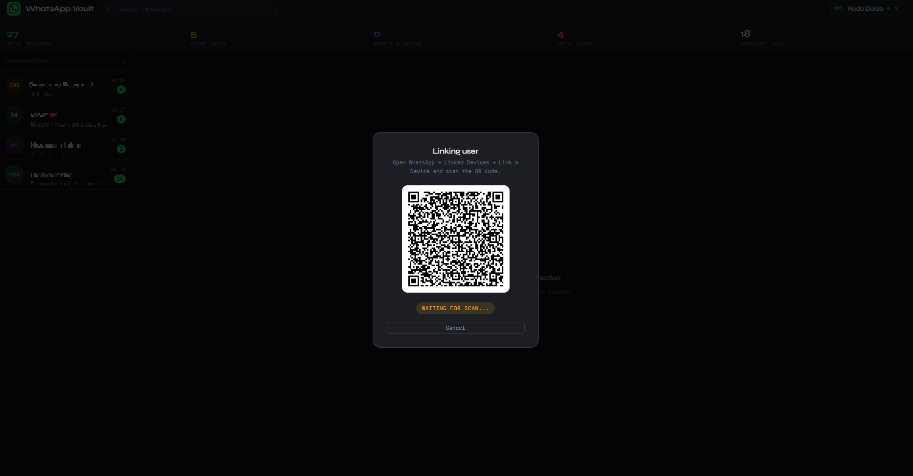
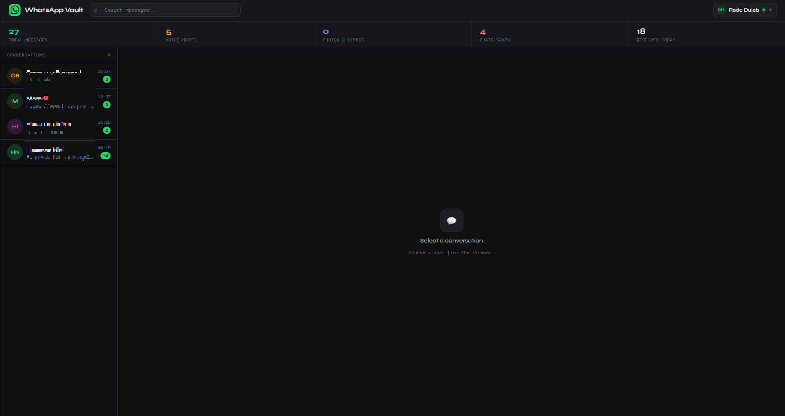
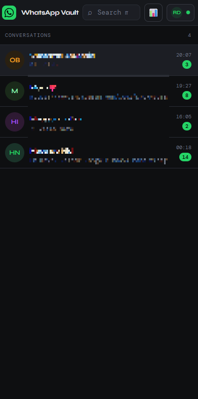
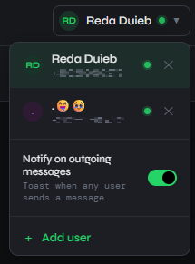

# WhatsApp Vault

> Self-hosted WhatsApp backup with a web dashboard.

Connect any number of WhatsApp accounts and capture every message — text, voice notes, photos, videos, stickers, documents, locations — into a local SQLite database. Browse, search, and manage everything from a clean web UI on your own server.

  

---

## Table of contents

- [Features](#features)
- [Screenshots](#screenshots)
- [Requirements](#requirements)
- [Quick start](#quick-start)
- [Detailed installation](#detailed-installation)
- [Linking a WhatsApp account](#linking-a-whatsapp-account)
- [Dashboard](#dashboard)
- [Configuration](#configuration)
- [Architecture](#architecture)
- [File layout](#file-layout)
- [How it works](#how-it-works)
- [API reference](#api-reference)
- [Database schema](#database-schema)
- [Backup & restore](#backup--restore)
- [Updating](#updating)
- [Security notes](#security-notes)
- [Built with](#built-with)
- [Roadmap](#roadmap)
- [FAQ](#faq)
- [Disclaimer](#disclaimer)
- [License](#license)

---

## Features

- 🔗 **Multi-account** — link multiple WhatsApp numbers, each in its own isolated session
- 💬 **Captures everything** — text, voice notes, photos, videos, stickers, documents, locations (with name/address/url), structured contact cards, polls
- 📝 **Edit & delete archive** — `message_edit` keeps the prev→new history, `message_revoke_everyone` flags the deletion but preserves the original body
- 💚 **Reactions** — every reaction is archived per sender; aggregated chips render under each message
- ✓✓ **Read receipts** — server / device / read / played ticks tracked on outbound messages
- 📊 **Polls** — option list captured at creation, live tally updates as votes arrive
- 📞 **Call log** — captured during the 30-min sweep via `Chat.fetchMessages`; each call lands as a `call_log` message with direction, duration, video/voice flag, and participants
- 👥 **Group activity log** — joins, leaves, subject/desc changes, admin promotions, and pending join requests
- 🪪 **Profile snapshots** — name, phone, about, description, business profile (address/hours/websites), and avatar versioned over time with diff-based dedupe; auto-refreshed every 30 min
- ↪ **Reply / forward context** — quoted-reply banners (click to scroll to parent), forward indicators, `@<number>` mention highlighting
- 🔔 **Live notifications** — toast in the dashboard for every new message, with optional outgoing-message alerts
- 🔍 **Full-text search** — scoped per account, rate-limited to 30 queries / 60 s
- 🗑 **Bulk delete** — clear individual messages or entire conversations (media files removed too)
- ⏪ **Pagination** — load older messages on demand, no full-history downloads
- 🔐 **API-key auth** — single-key protection on every endpoint, including the real-time SSE stream
- 📦 **Lightweight** — runs on a 1 GB VM, single Node process, SQLite storage
- 🎵 **In-browser playback** — voice notes, audio, and video stream directly in the dashboard with HTTP range support (seek + resume)
- 🖼 **Image lightbox** — click any photo to view full-size
- 📱 **Mobile-ready** — responsive single-pane layout, touch-friendly tap targets, full-screen QR modal
- 🔄 **Lazy reconnect** — disconnected sessions stay idle (no Chrome RAM) until you click Reconnect
- 🪄 **Stable scroll** — fingerprint-based diff render means edits, late-media, reactions, and polls update in place without yanking your scroll position

---

## Screenshots

<table>
  <tr>
    <td valign="top">
      <br>
      
    </td>
    <td valign="top">
      <br>
      
    </td>
  </tr>
</table>


---

## Requirements

- **Node.js 20+** (works on 22)
- **Google Chrome or Chromium** installed system-wide
- **Linux** (Ubuntu/Debian recommended; tested on Ubuntu 22.04 / 24.04)
- **2 GB RAM**, or 1 GB RAM + 2 GB swap if running on a small VM

---

## Quick start

```bash
# 1. Get the code
git clone https://github.com/reda1710/whatsapp-vault.git
# (or with SSH: git clone git@github.com:reda1710/whatsapp-vault.git)
cd whatsapp-vault
npm install

# 2. Generate an API key
node -e "console.log(require('crypto').randomBytes(32).toString('hex'))"

# 3. Create .env from the template and paste the key in
cp .env.example .env
nano .env   # set DASHBOARD_API_KEY (and PORT if 3001 is taken)

# 4. Start with PM2
npm install -g pm2
pm2 start ecosystem.config.js
pm2 save
pm2 startup
```

Open `http://<your-server>:3001`, paste your API key, and you're in.

---

## Detailed installation

### Install Chrome (Ubuntu)

```bash
wget -q -O - https://dl-ssl.google.com/linux/linux_signing_key.pub \
  | sudo gpg --dearmor -o /usr/share/keyrings/google-chrome.gpg
echo "deb [arch=amd64 signed-by=/usr/share/keyrings/google-chrome.gpg] http://dl.google.com/linux/chrome/deb/ stable main" \
  | sudo tee /etc/apt/sources.list.d/google-chrome.list
sudo apt update && sudo apt install -y google-chrome-stable
```

### Install Node 20+

```bash
curl -fsSL https://deb.nodesource.com/setup_22.x | sudo -E bash -
sudo apt install -y nodejs
```

### Add swap (only if RAM ≤ 1 GB)

```bash
sudo fallocate -l 2G /swapfile
sudo chmod 600 /swapfile
sudo mkswap /swapfile
sudo swapon /swapfile
echo '/swapfile none swap sw 0 0' | sudo tee -a /etc/fstab
free -h    # verify Swap shows 2.0G
```

### Open the dashboard port

Replace `3001` below with whatever you set as `PORT` in `.env`.

```bash
sudo iptables -I INPUT -p tcp --dport 3001 -j ACCEPT
sudo netfilter-persistent save
```

If you're behind a cloud firewall (Oracle Cloud, AWS, GCP), also add an ingress rule for the same TCP port in your VPC/security list.

### Run it

Then follow steps 1–4 from the [Quick start](#quick-start). To verify it's running:

```bash
pm2 logs vault
```

You should see `🌐 Dashboard: http://0.0.0.0:3001`.

---

## Linking a WhatsApp account

1. Open the dashboard and log in with your API key
2. Click the user dropdown (top-right) → **+ Add user**
3. Enter a display name (e.g. "Personal", "Work")
4. A QR-code modal opens. On your phone:
   **WhatsApp → Settings → Linked Devices → Link a Device**
5. Scan the QR — the modal closes automatically when authentication completes (~30 seconds)

The account's real name and phone number are pulled from WhatsApp once linked. Repeat steps 2–5 to add more accounts. Each runs in its own isolated Chrome session under `.wwebjs_auth/session-N/`.

---

## Dashboard

| Element | What it does |
|---|---|
| **User dropdown** (top-right) | Switch between linked accounts.<br>Status dot: 🟢 online · 🟡 authenticated · 🔴 awaiting QR · ⚪ offline |
| **Search box** | Full-text search across the selected user's messages |
| **Filter pills** | Filter by message type (All, Voice, Photos, Videos, Stickers, etc.) |
| **Hover a chat** | `✕` button to delete the entire conversation |
| **Hover a message** | `🗑` button to delete that single message |
| **"Select" pill** | Multi-select mode — tick messages, then bulk-delete |
| **Toggle in user menu** | Also notify on outgoing messages (off by default) |
| **Click a photo** | Opens a full-size lightbox |
| **Click a voice note** | Plays in place with a waveform indicator |
| **Click a document** | Downloads via the authenticated media route |
| **📊 button (mobile)** | Opens the stats panel as a dropdown |
| **← button (mobile)** | Returns from the chat view to the chat list |

The chat list auto-refreshes every 10 seconds. Live messages stream in via Server-Sent Events.

On first load the dashboard shows a login overlay — paste your API key once and it's kept in `sessionStorage` (cleared when you close the tab). 

Press `✕` in the user menu to log the user out.

Below 768 px, the layout switches to a single-pane chat view with a back button, the stats bar collapses into a topbar popover, and the QR modal goes full-screen.

---

## Configuration

All configuration lives in `.env`:

| Variable | Required | Default | Description |
|---|---|---|---|
| `DASHBOARD_API_KEY` | yes | — | 64-char hex key. The server refuses to start without it. |
| `PUPPETEER_EXECUTABLE_PATH` | recommended | auto-detected | Path to Chrome/Chromium. Auto-detects common paths if unset. |
| `PORT` | no | `3001` | Dashboard HTTP port |

Code-level constants you can tune in `bot/session-manager.js`:

| Constant | Default | Purpose |
|---|---|---|
| `QR_TIMEOUT` | 5 min | Stop Chrome if QR is never scanned (session gets killed and modal closes) |
| `READY_TIMEOUT` | 160 s | Restart if WhatsApp Web doesn't load after authentication |
| `RECONNECT_DELAY` | 8 s | Pause between failed start and the next attempt |
| `HEARTBEAT_MS` | 30 s | (in `database.js`) Bot status heartbeat written to SQLite |
| `MAX_MEDIA_BYTES` | 100 MB | (in `database.js`) Files larger than this are skipped |
| `SEARCH_LIMIT` / `SEARCH_WINDOW_MS` | 30 / 60 s | (in `dashboard/server.js`) Per-user search rate limit |
| `max_memory_restart` | 800 MB | (in `ecosystem.config.js`) PM2 restarts the process if it exceeds this |

---

## Architecture

```
┌──────────────────────────────────────────────────────┐
│  PM2 process: vault                                  │
│                                                      │
│   bot/index.js                                       │
│      ├── SessionManager                              │
│      │     └── Session × N (one per WA account)      │
│      │           ├── whatsapp-web.js Client          │
│      │           ├── headless Chrome                 │
│      │           ├── message queue                   │
│      │           └── late-media retry queue          │
│      ├── SQLite (vault.db, WAL mode)                 │
│      └── dashboard/server.js                         │
│            ├── Express API (/api/*)                  │
│            ├── SSE stream (/api/events)              │
│            └── Static dashboard                      │
└──────────────────────────────────────────────────────┘
                          │
                          ▼
                     Web browser
                  (HTML + vanilla JS)
```

The bot and dashboard run in a single Node process so they share the same `SessionManager` instance. Events flow correctly and Chrome sessions don't conflict.

---

## File layout

```
whatsapp-vault/
├── bot/
│   ├── index.js             # Entry point — boots manager + dashboard in one process
│   ├── session-manager.js   # WhatsApp session lifecycle (per-user Chrome)
│   ├── manager-instance.js  # Shared singleton holder (avoids circular requires)
│   └── database.js          # SQLite schema + prepared statements
├── dashboard/
│   ├── server.js            # Express API + SSE + media streaming
│   └── public/
│       ├── index.html       # Dashboard markup
│       ├── styles.css       # Dashboard styles
│       └── app.js           # Dashboard client logic
├── docs/
│   └── screenshots/         # README screenshots
├── ecosystem.config.js      # PM2 config (parses .env manually)
├── migrate-bin-files.js     # Optional one-shot media-rename utility
├── update.sh                # Helper: pm2 stop → git pull → npm install → restart
├── package.json
├── .env.example             # Sample env file (safe to commit)
├── .env                     # Your secrets (never commit)
└── .gitignore
```

Generated at runtime:

- `vault.db`, `vault.db-wal`, `vault.db-shm` — SQLite database
- `media/` — saved attachments, named `<userId>_<waId>.<ext>`
- `.wwebjs_auth/session-N/` — one folder per linked account

---

## How it works

**Capturing messages** — Each linked account runs a headless Chrome instance via `whatsapp-web.js`. When a message arrives, the bot downloads any attached media (with retry on failure), persists everything to SQLite in a single transaction, and writes the media to disk only after the DB commit succeeds. This avoids orphaned files on crash.

**Late media** — Newly-sent stickers and freshly-captured photos sometimes hit WhatsApp's CDN a few seconds after the message event. If the initial download returns nothing, the message is queued for delayed retry at 3s/8s/20s and patched into the existing DB row when the file is finally available. Bursts of stickers or photos are processed sequentially to avoid overwhelming the WhatsApp bridge.

**Real-time UI** — The dashboard uses Server-Sent Events (`/api/events`) to receive `qr`, `ready`, `status`, `message`, `message_edit`, `message_revoke`, `reaction`, and `vote_update` events as they happen. Each message bubble carries a fingerprint (id + body + edited_at + revoked_at + media_file + ack + reactions); the diff render only swaps DOM nodes whose fingerprint changed, so live updates land without resetting your scroll position or the playhead of an open video / voice note.

**Resilience** — Sessions handle transient WhatsApp Web errors (`Session closed`, `Target closed`, etc.) without flapping, and recover gracefully from Chrome OOM kills (with a longer cooldown so the kernel can reclaim memory). When a session disconnects or QR generation times out it goes "lazy" — Chrome is fully torn down and the user status shows a red dot until the user clicks **Reconnect**, so idle accounts don't burn RAM.

**Single-process design** — Bot and dashboard share one Node process and one `SessionManager` instance. PM2 with two separate apps would create two managers fighting over the same Chrome session folders.

**Multi-tenancy** — Every database row is scoped by `user_id` with cascading foreign keys. Deleting a user removes all their messages, chats, and media in one transaction. Each user has its own Chrome session folder, so accounts can never see each other's data.

---

## API reference

All endpoints require an `X-API-Key` header. The SSE endpoint accepts the key as a `?key=` query parameter since `EventSource` can't send custom headers.

### Authentication

```
X-API-Key: <your DASHBOARD_API_KEY>
```

### Users

```
GET    /api/users                     List users with live status
POST   /api/users                     Body: {name} — adds user, starts session
DELETE /api/users/:id                 Remove user, delete all their data
GET    /api/users/:id/qr              Current QR (data URL) and status
POST   /api/users/:id/connect         Start Chrome for an idle session (lazy reconnect)
POST   /api/users/:id/disconnect      Stop Chrome, keep the user record (red dot stays)
POST   /api/users/:id/cancel          Remove a brand-new user that never authenticated
```

### Chats and messages

```
GET    /api/chats?userId=N
GET    /api/chats/:chatId/messages?userId=N&limit=&offset=
DELETE /api/chats/:chatId?userId=N
DELETE /api/messages                  Body: {userId, ids: [...]}
GET    /api/messages/:id/edits?userId=N        Per-message edit history
```

### Profiles, polls, group activity

```
GET    /api/chats/:chatId/profile?userId=N           Latest cached profile snapshot
POST   /api/chats/:chatId/profile/refresh?userId=N   Force a live WA fetch (deduped)
GET    /api/chats/:chatId/profile/history?userId=N   Full snapshot timeline
GET    /api/chats/:chatId/group-events?userId=N      Joins/leaves/admin changes
GET    /api/contacts/:id/changes?userId=N            Phone-number migration log
GET    /api/polls/:waId/votes?userId=N               Live vote tally
```

Call entries are archived as `messages` rows of `type='call_log'` (with `call_is_video`, `call_duration_sec`, `call_participants` columns) — query them via `GET /api/chats/:chatId/messages` like any other message.

### Misc

```
GET    /api/bot-status                {online, beat_at}
GET    /api/stats?userId=N            Counts (omit userId for global stats)
GET    /api/search?userId=N&q=...     Full-text search (max 30/min/user)
GET    /api/media/:filename           Authenticated media stream (HTTP range supported)
GET    /api/events                    SSE: qr / ready / status / message / qr_timeout /
                                          message_edit / message_revoke / reaction / vote_update
```

### Example

```bash
curl -H "X-API-Key: $KEY" http://localhost:3001/api/users
```

---

## Database schema

All user data lives in a single `vault.db` SQLite file, scoped by `user_id` with FK cascade so deleting a user wipes everything they own.

```sql
users                 (id, name, phone, status, created_at)

messages              (id, user_id, wa_id, wa_serialized, chat_id, chat_name,
                       from_me, sender, body, type, timestamp,
                       media_file, mimetype, filename, lat, lng,
                       quoted_wa_id, mentions, is_forwarded, forward_score,
                       is_ephemeral, is_status, vcards,
                       loc_name, loc_address, loc_url,
                       edited_at, revoked_at, ack, poll_options,
                       call_is_video, call_duration_sec, call_participants)

chats                 (id, user_id, chat_id, name, is_group, last_msg_at,
                       last_body, last_type, msg_count, updated_at)

chat_profile_versions (id, user_id, chat_id, pic_filename, pic_hash,
                       name, phone, about, description, is_business,
                       participants, pushname, short_name, business_profile,
                       fetched_at)

message_edits         (id, user_id, message_id, prev_body, new_body, edited_at)
reactions             (id, user_id, msg_wa_id, sender_id, emoji, timestamp)
poll_votes            (id, user_id, poll_wa_id, voter_id, selected, timestamp)
group_events          (id, user_id, chat_id, event_type, actor_id,
                       target_ids, body, timestamp)
contact_changes       (id, user_id, old_id, new_id, is_contact, timestamp)
bot_status            (id, state, beat_at)
```

Schema migrates additively at startup via an `ensureColumn` / `CREATE TABLE IF NOT EXISTS` pattern — new versions of the bot can be dropped in over an existing vault without manual migration steps.

Indexed on `(user_id)`, `(user_id, chat_id)`, `(user_id, chat_id, timestamp)`, `timestamp`, and `type` for messages, plus per-table indexes on the new tables (e.g. `reactions(user_id, msg_wa_id)`, `group_events(user_id, chat_id, timestamp)`). WAL mode is enabled with `wal_autocheckpoint=100` for predictable I/O on burstable VMs.

---

## Backup & restore

Everything you need lives in three places: the database, the media folder, and the WhatsApp session folders.

### Backup

```bash
pm2 stop vault
tar czf vault-backup-$(date +%F).tar.gz vault.db media .wwebjs_auth .env
pm2 start vault
```

### Restore on another server

```bash
# Fresh install of the project, then:
pm2 stop vault   # if already running
tar xzf vault-backup-YYYY-MM-DD.tar.gz
pm2 start vault
```

The `.wwebjs_auth/` folder preserves your linked sessions, so no QR re-scan is needed.

---

## Updating

A helper script wraps the whole flow:

```bash
cd ~/whatsapp-vault
./update.sh
```

Or run the steps manually:

```bash
cd ~/whatsapp-vault
pm2 stop vault
git pull
npm install
pm2 restart vault
```

Your `.env`, `vault.db`, `media/`, and `.wwebjs_auth/` are not touched.

If you're upgrading from an older version that stored every attachment as `*.bin`, run the one-shot rename utility once after pulling:

```bash
npm run migrate
```

---

## Security notes

- **The API key is the only protection.** Treat it like a password. Generate 32 random bytes (64 hex chars).
- **Never commit `.env`** — it's in `.gitignore` for a reason.
- **HTTPS is recommended** if exposing the dashboard publicly. Put a reverse proxy (Caddy, Nginx, Cloudflare Tunnel) in front and terminate TLS there.
- **Rotate the API key** if you suspect it's been leaked: regenerate, update `.env`, then `pm2 delete all && pm2 start ecosystem.config.js`.
- **Be aware of WhatsApp's terms.** Linked devices are intended for personal use. Don't use this to spy on people without their consent.

---

## Built with

- [whatsapp-web.js](https://github.com/pedroslopez/whatsapp-web.js) — WhatsApp Web protocol client
- [better-sqlite3](https://github.com/WiseLibs/better-sqlite3) — synchronous SQLite for Node
- [Express](https://expressjs.com/) — HTTP server
- [PM2](https://pm2.keymetrics.io/) — process manager
- [Puppeteer](https://pptr.dev/) — headless Chrome automation (via whatsapp-web.js)

---

## Roadmap

Some ideas for future improvements:

- [ ] Export to JSON / mbox / HTML
- [ ] Per-user message retention policy (auto-delete after N days)
- [ ] Optional encrypted media storage at rest
- [ ] Multi-user dashboard auth (multiple API keys with per-account scoping)
- [ ] Metrics endpoint (Prometheus-compatible)
- [ ] Docker image
- [ ] HTTPS / Let's Encrypt integration
- [x] ~~Mobile-friendly responsive layout~~ — shipped

PRs welcome.

---

## FAQ

**Will this get my WhatsApp account banned?**
WhatsApp's terms permit linked devices for personal use. Behaviour-wise, this acts like the official desktop app. That said, it's an unofficial integration — use at your own risk and don't run automation that looks like spam.

**Does it download my entire history?**
No, only messages received while the bot is running. WhatsApp Linked Devices doesn't expose backfill of old messages.

**Can I run it on a Raspberry Pi?**
A Pi with more than 2 GB of RAM works well.

**Multiple users on the same machine?**
Yes — that's the core feature. Add as many accounts as RAM permits. Budget ~400 MB per account for Chrome.

**Where are my media files stored?**
In `media/` next to `vault.db`. Filenames are `<userId>_<waMessageId>.<ext>`.

**How big is the database?**
Pure text is tiny — millions of messages fit in under 1 GB. Media dominates disk usage; the 100 MB per-file cap stops single videos from filling your disk silently.

---
## Disclaimer

This project is not affiliated, associated, authorized, endorsed by, or in any way officially connected with WhatsApp or any of its subsidiaries or its affiliates. The official WhatsApp website can be found at [whatsapp.com](https://whatsapp.com). "WhatsApp" as well as related names, marks, emblems and images are registered trademarks of their respective owners. Also it is not guaranteed you will not be blocked by using this tool. WhatsApp does not allow bots or unofficial clients on their platform, so this shouldn't be considered totally safe.

---
## License

Personal-use project. Use responsibly.